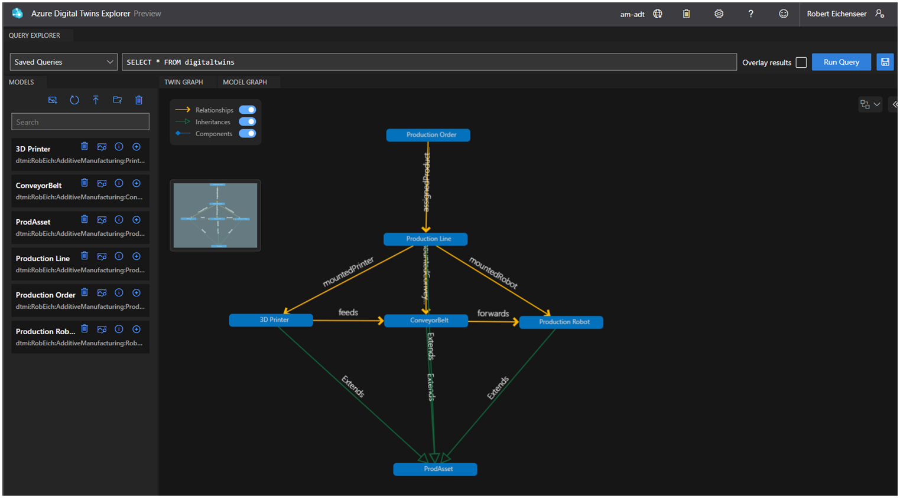

# Azure Digital Twins Models
## Companion Twin Model 

### Purpose
Example of a simplified Azure Digital Twins Model to highlight / demonstrate manufacturing use cases

### Content
Model highlights the interaction between physical assets like: 
- 3D-Printer
- Conveyor Belt
- Robot
- Production Line 
and non-physical objects like: 
- Production Order 

All physical assets inherit or extend ProdAsset (Telemetry & Property). 

### Relationships

